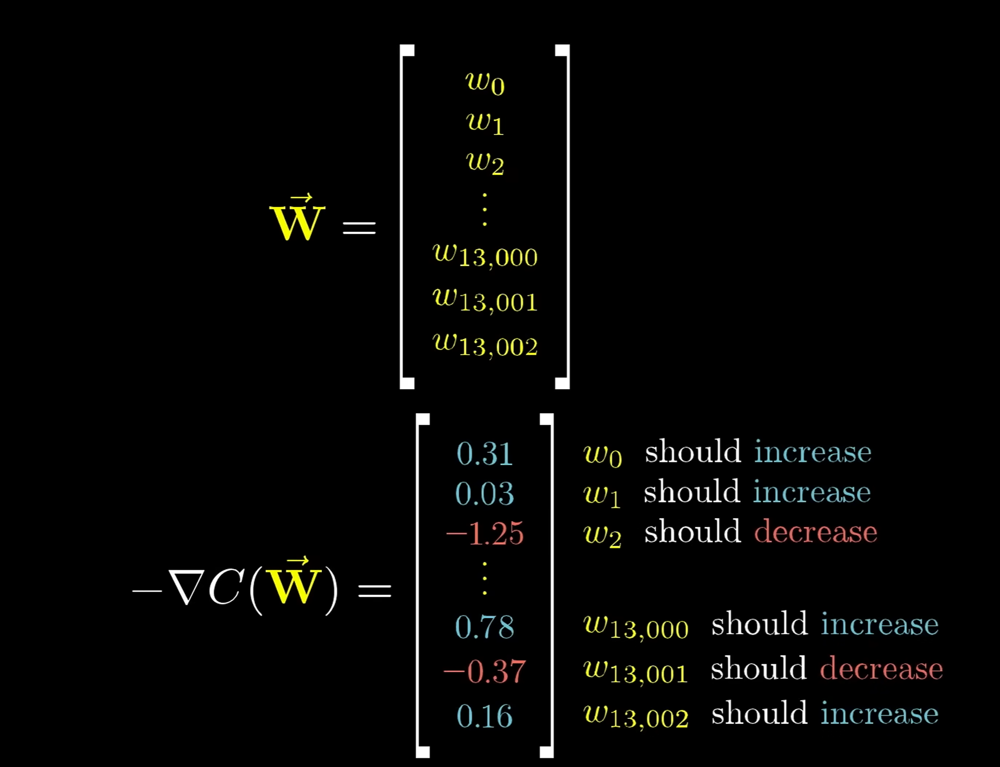
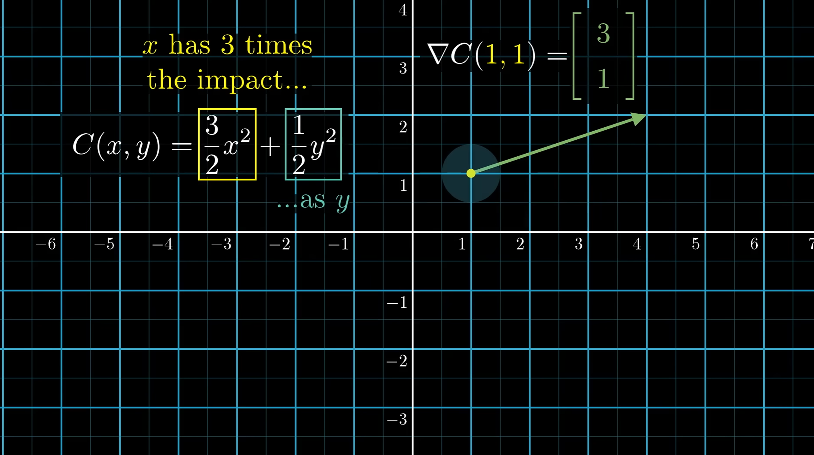

To initialise training, weights and biases are assigned randomly. From here, you define a cost function.
It takes the number of weights and biases, and outputs a single number (the cost) describing how bad those weights and biases are, and is defined by the network's behaviour of all of the training data.
To do this, the squares of the differences between "trash" activations and the desired value which results in the cost of a single training outcome, so this is then done for all training data, (average cost of all training data).
Network learning = minimising cost function, importantly it should have a smooth output, to find a local minimum by taking small (and increasingly smaller) steps downhill.
This process of repeatedly nudging an input of a function by some multiple of the negative gradient is called gradient descent.  
A way to think of the proportional benefit is that it encodes the relative importance of weights and biases (by the sign and magnitude of the value).

To summarise, the gradient of the cost function tells us what nudges to all weights and biases cause the fastest changes to the value of the cost function.
