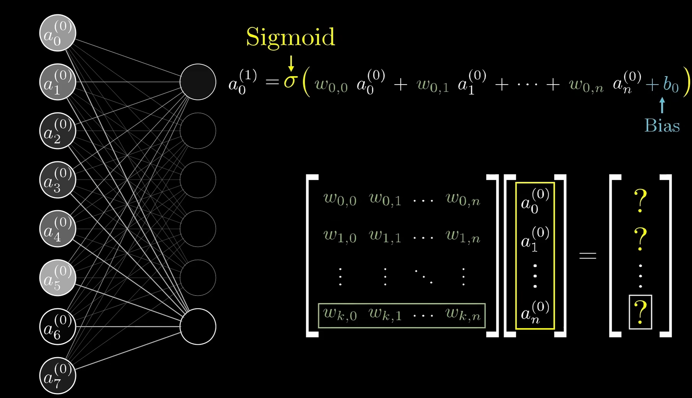
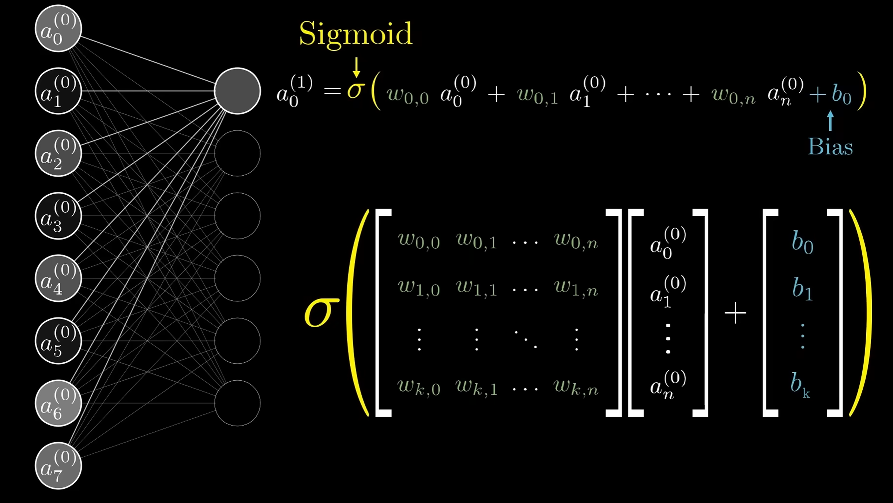
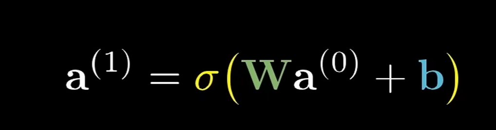

Neural networks are inspired by the brain, neuron is essentially a function, that takes all the outputs of the previous layer, and outputs a number between 0 and 1.
The number inside a neuron is called it's activation. 
In the last layer, the activation in those neurons represents how much the system thinks that a given image corresponds to a given digit.
There are also hidden layers inbetween.
Activations in one layer determine activations in the next layer. 
How does this work?
This example of reading numbers is essentially broken down into layers that start off small, activate when they are matched, and the next layer may combine some of these small characteristics into larger characteristics, and it would get to the point where the second last layer is essentially identifying major components of the input, and then sequencing or combining a specific series of characteristics into what are the most probably digits in the final or output layer correspond to.
This is layers/layering abstraction. For example, parsing speech involves taking raw audio, and identifying specific sounds, which combine to form certain syllables, which combine to form words which comebine to make up phrases and so on.
Weights are assigned to connections between neurons, and thereafter these weights and activations would result in their weighed sum.
You can assign negative and positive weights, which essentially is used to determine where patterns/edges/etc move beyond the desired value.
Sigmoid function is what is used to measure how positive relevant weighted sums are. If you want a weighted sum to only activate meaningfully when it surpasses a particular value, you just need to add a value, known as the bias. Which tells you how high the weighted sum needs to be, before the neuron gets meaningfully activated.
Every neuron is connected to the next layer of neurons, as well as it's own weights and biases.
What learning is referring to is getting a computer to find a valid settings for all of these biases such that it will solve the problem at hand.
Easiest ways to represent this activation function is using vectors and matrixes. 
 is the ultimate consolidated function.
